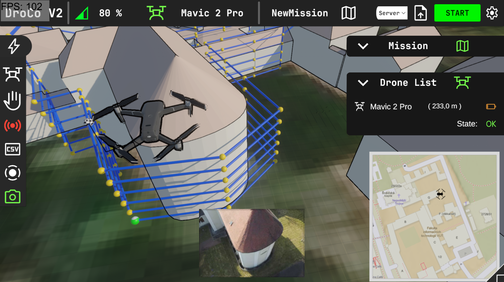
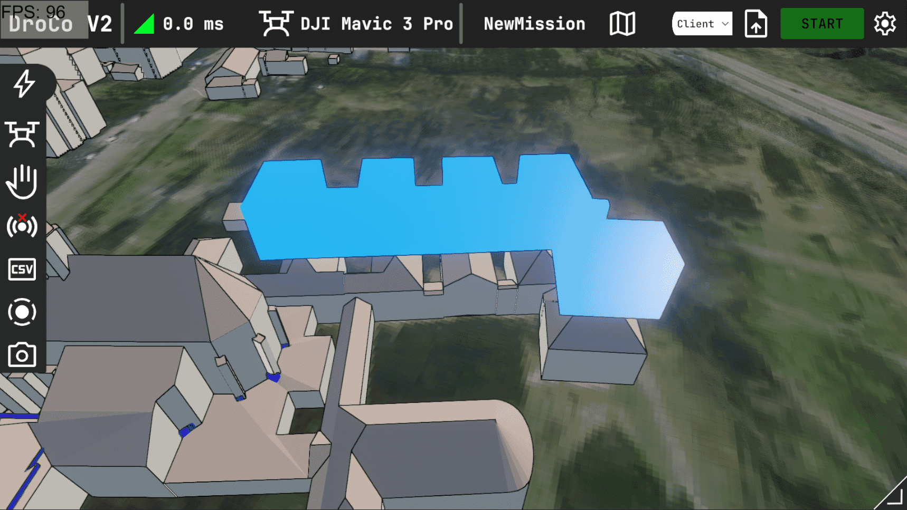
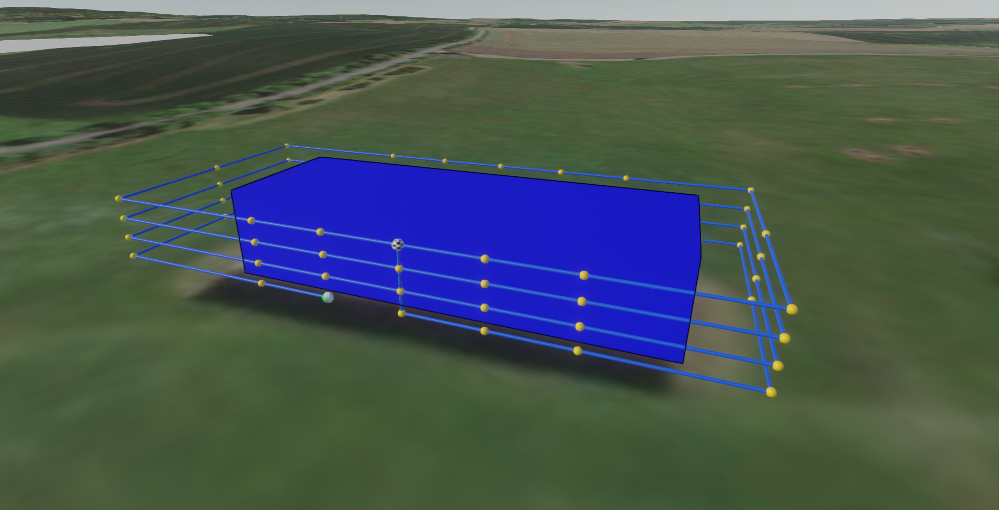
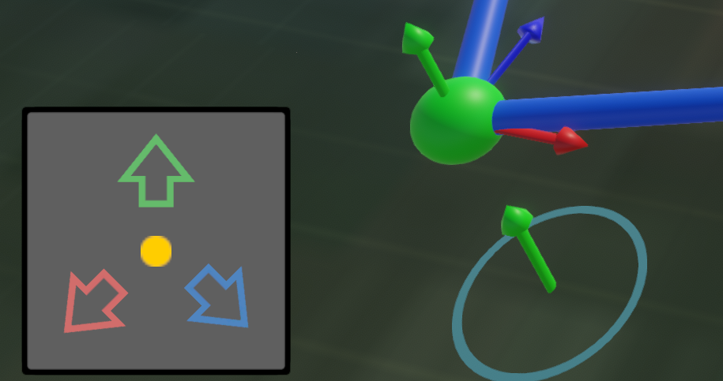
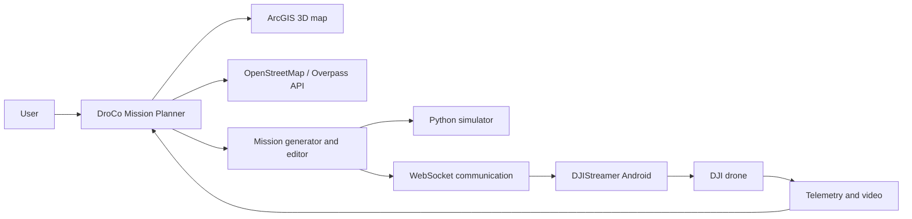

# DroCo Mission Planner

> Planning, visualisation, and control of drone inspection missions around buildings.

DroCo Mission Planner is a Unity application for preparing aerial inspections of buildings and construction complexes. It allows users to select a building directly on a 3D map, automatically create an inspection route around it, adjust individual waypoints, and then simulate the mission or send it to a real drone.

The project was created as an extension of the DroCo system developed at the Faculty of Information Technology at Brno University of Technology.

<p align="center">
  <!-- Replace this path with the main application screenshot -->
  
</p>

<p align="center">
  <a href="#features">Features</a> ·
  <a href="#how-it-works">How it works</a> ·
  <a href="#running-the-project">Run</a> ·
  <a href="#architecture">Architecture</a> ·
  <a href="#documentation">Documentation</a>
</p>

---

## About the project

Building inspection with a drone often begins before the flight itself: choosing the right area, estimating the shape of the building, and preparing a safe route.

DroCo brings this process together in one environment:

1. the user selects a building on the map,
2. the application loads its footprint from OpenStreetMap,
3. an inspection trajectory is generated around the building,
4. the user adjusts the route as needed,
5. the mission is launched in the simulator or sent to the drone.

The result is a clear 3D tool for reviewing and refining a planned mission before it is carried out.

---

## Features

### 3D map and buildings

- 3D map environment based on ArcGIS Maps SDK for Unity
- direct building selection on the map
- building highlighting when hovering over the map
- building footprint retrieval from OpenStreetMap through the Overpass API
- conversion of geographic coordinates into Unity 3D space

### Automatic mission planning

- automatic route generation based on the building footprint
- configurable distance from the building
- configurable vertical step and segment length
- support for vertical and horizontal mission patterns
- collision checking and a basic safety distance
- route visualisation using waypoints and connecting lines

### Route editing

- selection of individual waypoints in the scene
- waypoint movement using 3D manipulators
- adjustment of waypoint altitude and position
- editing through controls in the user interface
- mission parameters displayed in a side panel

### Drone connection

- WebSocket communication
- server and client modes
- transmission of telemetry, battery status, GPS data, and warnings
- transmission of image data from the drone
- Virtual Stick control support
- uploading and controlling waypoint missions

Verified real-flight platform:

> DJI Mavic Mini 1 connected through the DJIStreamer application.

### Simulation without a physical drone

The project includes a simple Python simulator that connects to the Unity application and simulates:

- movement between waypoints,
- GPS coordinates,
- altitude and orientation,
- battery status,
- signal strength and satellite count,
- warning states,
- an image stream.

This makes it possible to test the basic mission workflow without connecting a physical drone.

### User interface

- overview of the drone status
- battery and signal indicators
- GPS and flight data
- quick actions for the camera, video, return-to-home, and stopping
- collapsible panels
- live video preview
- colour-coded status icons
- animated panel transitions

---

## How it works

### 1. Select a building

A building can be selected by double-clicking directly on the map. The application then sends a request to the Overpass API and loads the building geometry.

<p align="center">
  <!-- Screenshot of the loaded building -->
  
</p>

### 2. Generate a trajectory

After the building has been loaded, the application creates an inspection route at the selected altitude and distance from the building.

<p align="center">
  <!-- Screenshot of the generated mission -->
  
</p>

### 3. Edit waypoints manually

Each waypoint can be selected and adjusted using 3D manipulators directly in the scene or through the control panel.

<p align="center">
  <!-- Screenshot of waypoint editing -->
  
</p>

### 4. Simulate or fly the mission

The prepared mission can be started with the simulator or sent through DJIStreamer to a connected drone.

<p align="center">
  
</p>

---

## Architecture



Communication between the Unity application and DJIStreamer takes place over WebSocket. The system can transfer, among other things:

- information about the connected drone,
- GPS position,
- altitude and speed,
- orientation,
- battery status,
- warnings,
- mission progress,
- video frames,
- commands for starting, pausing, and stopping a mission.

Podrobnosti jsou uvedeny v dokumentu [`COMMUNICATION_API.md`](COMMUNICATION_API.md).

---

## Requirements

### Opening the Unity project

- Unity Hub
- Unity Editor `2022.3.23f1`
- Visual Studio Community 2022 nebo kompatibilní IDE
- Windows Build Support
- Android Build Support
- Git Bash
- Visual C++ Redistributable 2015–2022 x64

### Running the simulator

- Python 3
- balíčky uvedené v [`requirements.txt`](requirements.txt)

Install the Python dependencies with:

```bash
pip install -r requirements.txt
```

---

## Running the project

1. Open the project in Unity Editor `2022.3.23f1`.
2. Open the scene:

```text
Assets/ArcGISMapsSDK/Scenes/MainScene
```

3. Start the scene by clicking **Play**.
4. Wait for the map data to load.
5. Double-click a building to create a mission.

An internet connection is required to load the map and building data for the first time.

---

## Running the simulator

First start the server mode in DroCo. Then run:

```bash
python drone_interactive.py 5556
```

The simulator connects to the local WebSocket server and begins sending telemetry to the Unity application.

The simulator is intended primarily for development and workflow demonstrations. It is not a physically accurate flight simulation.

---

## Connecting a real drone

To perform a real flight:

1. start DroCo in server mode,
2. connect the DJIStreamer application,
3. enter the IP address of the computer running DroCo,
4. use port `5556`,
5. enable the live data stream,
6. enable Virtual Sticks,
7. start the prepared mission in DroCo.

Before an actual flight, always verify:

- GPS signal,
- battery level,
- available airspace,
- safe altitude,
- the return-to-home procedure,
- the correct drone and controller configuration.

Real-flight support was verified on the DJI Mavic Mini 1 platform.

---

## Building the project

1. Open the project in the required Unity version.
2. In Unity, select:

```text
File → Build Settings
```

3. Keep only the `MainScene` scene enabled.
4. Select the target platform.
5. Configure the resolution and window mode in `Player Settings`.
6. Click **Build**.

It is recommended to store the build output outside the main project directory.

---

## Project structure

```text
DroCo/
├── Assets/
│   ├── Scripts/
│   │   ├── Buildings/    # loading buildings from OpenStreetMap
│   │   ├── Drones/       # drone model and status
│   │   ├── Managers/     # main application managers
│   │   ├── Missions/     # mission generation and editing
│   │   ├── UI/           # original user interface
│   │   ├── UI2/          # extended user interface
│   │   └── Waypoint/     # waypoint selection
│   ├── Animations/
│   ├── Icons/
│   ├── Materials/
│   ├── Models/
│   ├── Prefabs/
│   └── Settings/
├── Packages/
├── ProjectSettings/
├── Submodules/
├── drone_interactive.py
├── COMMUNICATION_API.md
├── QUICK_REFERENCE.md
└── requirements.txt
```

The most important parts of the implementation are:

| Area | Main files |
|---|---|
| Route generation | `Assets/Scripts/Missions/MissionGenerator.cs` |
| Mission control | `Assets/Scripts/Missions/MissionController.cs` |
| Waypoint editing | `Assets/Scripts/Missions/MissionEditor.cs` |
| Navigation | `Assets/Scripts/Missions/Navigator.cs` |
| Building retrieval | `Assets/Scripts/Buildings/BuildingFetcher.cs` |
| OpenStreetMap data | `Assets/Scripts/Buildings/OSMData.cs` |
| WebSocket server | `Assets/Scripts/Managers/WebSocketServer.cs` |
| WebSocket client | `Assets/Scripts/Managers/WebSocketClient.cs` |
| Drone status | `Assets/Scripts/Managers/StatusManager.cs` |

---

## Documentation

- [`COMMUNICATION_API.md`](COMMUNICATION_API.md) – complete WebSocket API
- [`QUICK_REFERENCE.md`](QUICK_REFERENCE.md) – quick overview of messages and commands
- [`JSON_EXAMPLES.json`](JSON_EXAMPLES.json) – communication examples
- [`README2.md`](README2.md) – running the build and simulator
- [`README3.md`](README3.md) – program documentation
- [`README4.md`](README4.md) – supporting materials
- [`README5.md`](README5.md) – DJIStreamer application extension

---

## Limitations

- Building retrieval depends on the availability of the Overpass API and an internet connection.
- Real drone control was verified on the DJI Mavic Mini 1.
- The Python simulator is not a physically accurate flight simulation.
- The simulator's waypoint mode is intended for testing and demonstrations.
- The quality and safety of a mission depend on the route configuration and actual flight conditions.

---

## Technologies

- Unity `2022.3.23f1`
- C#
- Python
- ArcGIS Maps SDK for Unity
- OpenStreetMap
- Overpass API
- WebSocket
- DJI SDK
- GStreamer
- TextMesh Pro
- JetBrains Mono

---

## Author

**Václav Sovák**  
Faculty of Information Technology  
Brno University of Technology

Bachelor's thesis, 2026

Supervisor: **Ing. Daniel Bambušek**

---

## Licence and sources

This project extends the DroCo system developed at the Faculty of Information Technology at Brno University of Technology.

Used sources and technologies:

- [OpenStreetMap](https://www.openstreetmap.org/) – map data
- [ArcGIS Maps SDK for Unity](https://developers.arcgis.com/unity/)
- [JetBrains Mono](https://www.jetbrains.com/lp/mono/) – user interface font
- [Google Material Icons](https://fonts.google.com/icons)
- [DJI SDK](https://developer.dji.com/)
- [GStreamer](https://gstreamer.freedesktop.org/)

OpenStreetMap data is used in accordance with the ODbL licence.
